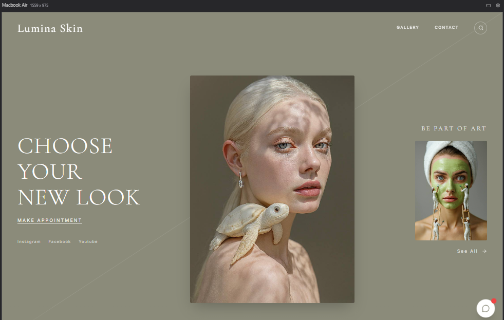
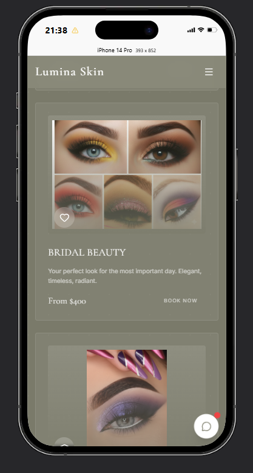

# Lumina Skin — Landing Page de Beleza (React + Vite)

Landing page moderna e responsiva para estúdio de beleza, com foco em experiência visual, animações suaves, cards de serviços, galeria e chat flutuante.

## 🌐 Acesso online

- Site publicado (GitHub Pages): https://welbennyskennedy.github.io/Lumina-Skin/

## Preview

### Desktop


### Mobile


## ✨ Principais funcionalidades

- **Hero section** com identidade visual editorial e CTA principal.
- **Preloader animado** na abertura do site.
- **Seções completas**: About, Gallery, Services, Testimonials, Contact e Footer.
- **Cards de serviço responsivos** com imagens centralizadas e animações de hover.
- **Chat flutuante** com respostas rápidas e layout adaptado para mobile.
- **Navegação com scroll suave** e interações refinadas.
- **Design system com Tailwind + componentes UI** reutilizáveis.

## 🧱 Stack utilizada

- **React 19**
- **TypeScript**
- **Vite**
- **Tailwind CSS**
- **Radix UI** (base para componentes)
- **Lucide React** (ícones)
- **ESLint**

## 📁 Estrutura do projeto

```txt
app/
├─ public/
│  └─ images/
│     ├─ Desktop.png
│     ├─ Mobille.png
│     ├─ hero-main.jpg
│     ├─ hero-mask.jpg
│     ├─ hero-turtle.jpg
│     └─ ...
├─ src/
│  ├─ components/
│  │  ├─ Header.tsx
│  │  ├─ Preloader.tsx
│  │  ├─ ChatWidget.tsx
│  │  └─ ui/
│  ├─ sections/
│  │  ├─ Hero.tsx
│  │  ├─ About.tsx
│  │  ├─ Gallery.tsx
│  │  ├─ Services.tsx
│  │  ├─ Testimonials.tsx
│  │  ├─ Contact.tsx
│  │  └─ Footer.tsx
│  ├─ App.tsx
│  ├─ main.tsx
│  └─ index.css
├─ package.json
└─ vite.config.ts
```

## 🚀 Como rodar localmente

### Pré-requisitos

- **Node.js** 18+
- **npm** (ou pnpm/yarn)

### Instalação

```bash
npm install
```

### Ambiente de desenvolvimento

```bash
npm run dev
```

A aplicação ficará disponível no endereço exibido pelo Vite (geralmente `http://localhost:5173`).

### Build de produção

```bash
npm run build
```

### Pré-visualizar build

```bash
npm run preview
```

### Lint

```bash
npm run lint
```

## 🎨 Personalização rápida

### Marca e textos

- Ajuste nome, mensagens e identidade em:
  - `src/components/Header.tsx`
  - `src/components/Preloader.tsx`
  - `src/sections/Footer.tsx`
  - `src/components/ChatWidget.tsx`

### Imagens

- Substitua imagens em `public/images` mantendo os mesmos nomes para não quebrar referências.
- Ou atualize os caminhos diretamente nos arquivos de seção (`Hero.tsx`, `Gallery.tsx`, `Services.tsx`).

### Estilos globais

- Tokens de cor, fontes e classes utilitárias estão em `src/index.css`.
- Configurações de tema Tailwind em `tailwind.config.js`.

## 📱 Responsividade

O layout foi pensado com breakpoints de mobile, tablet e desktop, incluindo:

- Tipografia fluida.
- Grid adaptável para cards e galeria.
- Chat com ajuste de altura em viewport dinâmica no mobile.

## ✅ Scripts disponíveis

| Script | Descrição |
|---|---|
| `npm run dev` | Inicia servidor de desenvolvimento |
| `npm run build` | Gera build otimizada para produção |
| `npm run preview` | Serve a build localmente para validação |
| `npm run lint` | Executa análise estática com ESLint |

## 🛠️ Próximos passos sugeridos

- Integrar formulário de contato com backend (API/email service).
- Conectar chat a atendimento real (WhatsApp/API de suporte).
- Otimizar imagens com conversão para WebP/AVIF.
- Configurar deploy contínuo (Vercel/Netlify).

## 📄 Licença

Projeto para uso de portfólio/apresentação. Ajuste a licença conforme sua necessidade comercial.
